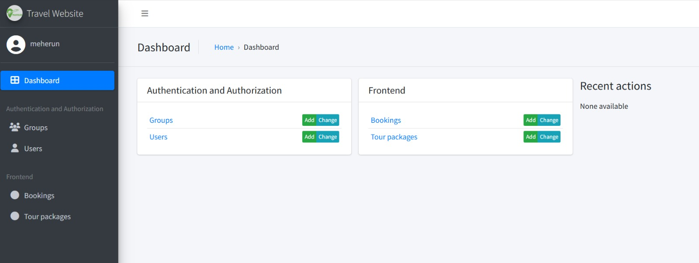
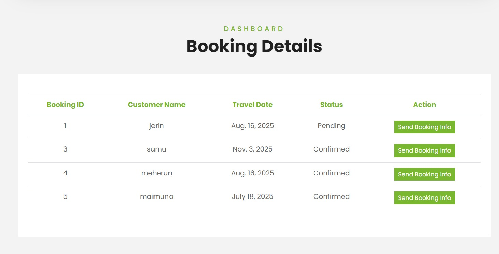
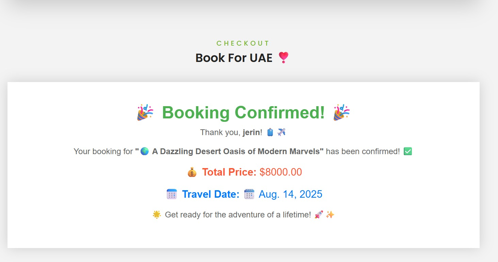

# 🌍 International Travel Booking Website

A user-centric and responsive **destination package booking platform** designed to simplify and enhance the travel planning experience. It enables travelers to explore, filter, and book complete travel packages including accommodation, meals, transportation, and activities.

---

## 🚀 Key Features

### ✈️ For Users:
- 🧳 **Browse Destination Packages** – Curated options tailored to various travel styles.
- 🔍 **Advanced Filters** – Search by budget, duration, destination, or travel type.
- 📄 **Detailed Inclusions** – View all components like hotel, transport, meals, and activities.
- ✅ **Instant Confirmation** – Get booking confirmation and itineraries immediately.
- ☎️ **24/7 Customer Support** – Continuous assistance for inquiries and changes.

### 🛠️ For Administrators:
- 📦 **Package Management** – Add, update, and delete destination packages.
- 📊 **Analytics Dashboard** – Track bookings, trends, and user preferences.
- 💬 **Feedback & Inquiries** – Respond to customer queries efficiently.
- 🎯 **Promotions** – Launch and highlight featured or discounted packages.

---

## 🧰 Tech Stack

**Frontend**  
- HTML  
- CSS  
- JavaScript  

**Backend**  
- Python (Django Framework)

**Database**  
- SQLite  

**Authentication**  
- Django Auth (CSRF Token Protection)

---

## 🧭 Use Cases

1. **User Registration & Login** – Secure access for users and admins.
2. **Package Browsing & Booking** – Filter and book full travel packages.
3. **Admin Functions** – Add/edit/remove packages, manage admins, view insights.
4. **Dashboard Access** – Bookings, analytics, and personalized views.

---

## 🖼️ Core Pages

- Home  
- Register & Login  
- Package Listings  
- Booking Page  
- About Us  
- Admin Dashboard  
- Analytics Panel  

---

## 👩‍💻 Team Members

| Name                | ID       |
|---------------------|----------|
| Meherun Nesa Jerin  | C233436  |
| Mostafa Arfin       | C233431  |


---

## ⚙️ Setup & Installation

1. **Website Live**
   ```bash
   (http://127.0.0.1:8000/)






